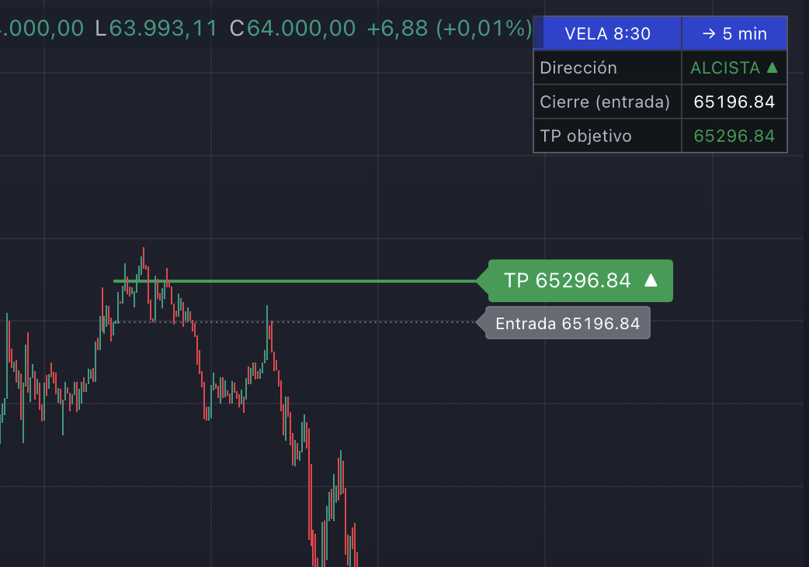

# Vela 8:30 → TP ±100 pts

Indicador para TradingView (Pine Script v6) que detecta la vela de las **8:30** (en un gráfico de **5 minutos**) y calcula un take profit (TP) a partir de su cierre:

- Si la vela cierra **alcista** → TP = cierre + X puntos
- Si la vela cierra **bajista** → TP = cierre − X puntos

Cuando la vela objetivo cierra, el indicador:

- Dibuja una línea horizontal con el nivel de TP y otra (opcional) con el precio de entrada (cierre de la vela).
- Muestra una tabla de resumen en la esquina superior derecha con la dirección, el precio de entrada y el TP objetivo.
- Lanza un aviso (`alert`) con el resultado, para poder configurar una alerta de TradingView que te lo notifique en cuanto cierre la vela.

## Configuración en TradingView

1. Abre el editor Pine (**Pine Editor**, parte inferior de TradingView) .
2. Pega el contenido de [`vela-830-tp.pine`](vela-830-tp.pine) y pulsa **Add to chart** / **Guardar**.
3. **Pon el gráfico en temporada de 5 minutos.** Si no está en 5 min, el propio indicador muestra un aviso en pantalla (⚠ *Pon el gráfico en 5 min*).
4. Ajusta la **zona horaria** para que "8:30" corresponda a la hora que realmente quieres (por defecto `Europe/Madrid`). Esto se configura desde los parámetros del indicador, grupo **Configuración**.
5. Revisa y ajusta el resto de parámetros según lo necesites:

   | Parámetro | Descripción | Valor por defecto |
   |---|---|---|
   | Hora de la vela | Hora objetivo (0-23) | 8 |
   | Minuto de la vela | Minuto objetivo (0-59) | 30 |
   | Zona horaria | Zona horaria para calcular hora/minuto | Europe/Madrid |
   | Puntos para el TP | Distancia en puntos del TP respecto al cierre | 100 |
   | Horas que se extiende la línea | Cuánto se alargan las líneas hacia la derecha | 13 |
   | Mostrar línea de entrada | Muestra/oculta la línea del cierre de la vela | Activado |
   | Mostrar días anteriores (historial) | Conserva las líneas/etiquetas de días anteriores en vez de borrarlas | Desactivado |
   | Mostrar tabla de resumen | Muestra/oculta la tabla superior derecha | Activado |
   | Color alcista / Color bajista | Colores de líneas y tabla según dirección | Verde / Rojo |

6. Para recibir notificaciones, crea una **alerta** de TradingView sobre este indicador (clic derecho en el gráfico → **Añadir alerta**, o el icono de reloj) usando la condición del propio indicador. El mensaje de la alerta ya incluye la dirección, el cierre y el TP calculados.

## Historial de cambios

Las mejoras, cambios y correcciones de cada versión están en [`CHANGELOG.md`](CHANGELOG.md).
